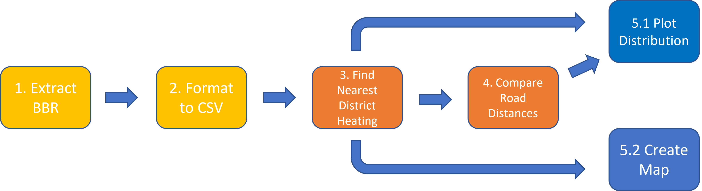

[](https://opensource.org/licenses/MIT) 
[](https://cran.r-project.org/bin/windows/base/old/4.1.2/NEWS.R-4.1.2.html) 
[](https://docs.python.org/3/) 

# parsing-gas
This repository contains and data for the project ["Parsing Gas: a Scalable Pipeline for Nearest Neighbour Calculations on Spatial Data"](https://docs.google.com/document/d/1QARkB9bbmuBmNGZnxdJk5fv-x4OBOQfLu0BlF04vgGE/edit?usp=sharing). The overarching goal of the project is to answer the following question: *What ist the distribution of distances from gas-heated buildings to the district-heating network in Denmark?*. 

## Data
The repository depends on data from the BBR ("Building and Housing Register") - a public database maintained by the Housing Agency. Below are a description of the data artifacts. 

Filename | Description | License | Source | Generated by [`reproduce.sh`](./reproduce.sh)
---- | --- | --- | --- | --- 
`BBR_Aktuelt_Totaludtraek_XML_20220517180008.zip` | The complete 65GB dataset from the BBR | NA | [datafordeler.dk](https://datafordeler.dk/) | :x:
`bbr_clean.csv`| Processed dataset | MIT | [Instructions here](#downloading-the-data) | ✔️
`output/gas_fjernvarme_xy.csv`| Euclidean distance to district heating network for each gas-heated building | MIT | Generated by [`analyse_distances.py`](./analyse_distances.py) | :heavy_check_mark:
`output/{KOMMUNE-ID}_road_dist.csv`| Comparison of road distance and Euclidean distance for a specific municipality (see codes [here](./kommunekode.csv)| MIT | Generated by [`analyse_road_dists.py`](./analyse_road_dists.py) | :heavy_check_mark:


## Reproducing the results 
TL;DR: An example of the entire setup and running the pipeline can be run using the bash-script `reproduce.sh`. 

Below I explain how to reproduce the analyses and plots of my report. 

### Setting up the Environment
This project uses [mamba](https://mamba.readthedocs.io/en/latest/), a blazingly fast cross-platform package manager for data science. As described in their docs, it is most easy to install through either [miniconda](LINK) or [anaconda](LINK) so make sure to have one of these installed on your system! After that it is as easy as running the [`setup.sh`](./setup.sh) script in a bash terminal. 

The dependencies of this project are in two yml-files. [`full_environment.yml`](/full_environment.yml) has the minimal dependencies and is the file used by [`setup.sh`](/setup.sh). [`frozen_env.yml`](/frozen_env.yml) has the complete 'frozen' environment exactly as was used on my machine. If there are any problems with the setup script it might be a good idea to install directly from the frozen environment with the following command: 

```console
mamba env create -f frozen_env.yml
```

### Tests
Parts of the project are developed using a [test-driven development](https://en.wikipedia.org/wiki/Test-driven_development) framework using [pytest](https://docs.pytest.org/en/7.1.x/). The tests can be run using the following commands: 

```{console}
python -m pytest --cov-report term --cov ./src
```

This will print a coverage report to the terminal.  

### Downloading the data
The formatted data is stored in a .csv-file in Google Drive. It can be downloaded manually by following [this link](https://drive.google.com/file/d/1bSWGPgW8K4S9BiWFasG32rhqevCG8OkM/view?usp=sharing), and unzipping the file to the `data/raw` directory. However, the recommended way is to run the `download_data.sh` as this does it all automagically.

### Description of the Scripts
Below is a high level overview of the different scripts in the repo in relation to the analysis pipeline:



Name | Component of Pipeline | Description | Part of `reproduce.sh` 
---- | :----: | :---: | ---:
[`extract_bbr.py`](/extract_bbr.py)| 1. Extract BBR | Parses building information from the full BBR xml | :x:
[`format_bbr.py`](/format_bbr.py)| 2. Format to CSV | Extracts relevant columns to a .CSV | :x:
[`analyse_distances.py`](LINK)| 3. Find Nearest District Heating | Does Euclidean distance calculations | :heavy_check_mark:
[`analyse_road_dists.py`](./analyse_road_dists.py)| 4. Compare Road Distances | Compares Euclidean Distances for Aabenraa and Gentofte respectively | :heavy_check_mark:
[`plot_dists.R`](/plot_dists.R)| 5.1 Plot Distributions| Plots distribution of distances (found [here](./plots/))| :heavy_check_mark:
[`leaflet_map.R`](/leaflet_map.R)| 5.2 Create Map | Creates an interactive map of gas-heated buildings and their distance | :heavy_check_mark:

All of the python scripts are documented using [argparse](https://docs.python.org/3/library/argparse.html). This means that full documentation can be found using the `--help`-flag.

### Description of /src
To improve coherence and make the code more [SOLID](https://www.digitalocean.com/community/conceptual_articles/s-o-l-i-d-the-first-five-principles-of-object-oriented-design) I have refactored much functionality into a `/src` directory. An overview can be seen below: 

Name | Description | Part of tests 
--- | --- | --- 
[`extract.py`](src/extract.py) | For parsing the BBR data efficiently | :heavy_check_mark:
[`wrangle_bbr.py`](src/wrangle_bbr.py) | Formats the BBR data to a readable format | :heavy_check_mark:
[`geo_transform`](src/geo_transform.py) | Transforms the data into coordinates | :heavy_check_mark:
[`util.py`](src/extract.py) | Simple helper functions for reading and writing files | :x:


# TODO 
- [x] Finish reproducability
    - [x] Refactor leaflet map creation
    - [x] Add leaflet map to script 
    - [x] Test run (again)
- [ ] Expand README
    - [x] Copy CDS template
    - [x] Create reproduce instructions
- [ ] Clean repo
    - [x] Create plot folder
    - [x] Remove dead files
    - [ ] Document scripts
- [x] Explain artifacts
    - [x] Explain scripts
    - [x] Explain datasets (generated and downloaded)
- [ ] WRITE(!)
    - [x] Add Sources / references
    - [ ] Incorporate Feedback
    - [ ] Format into niceness
